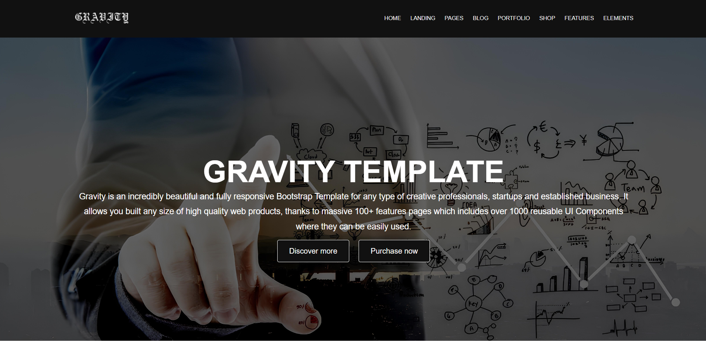
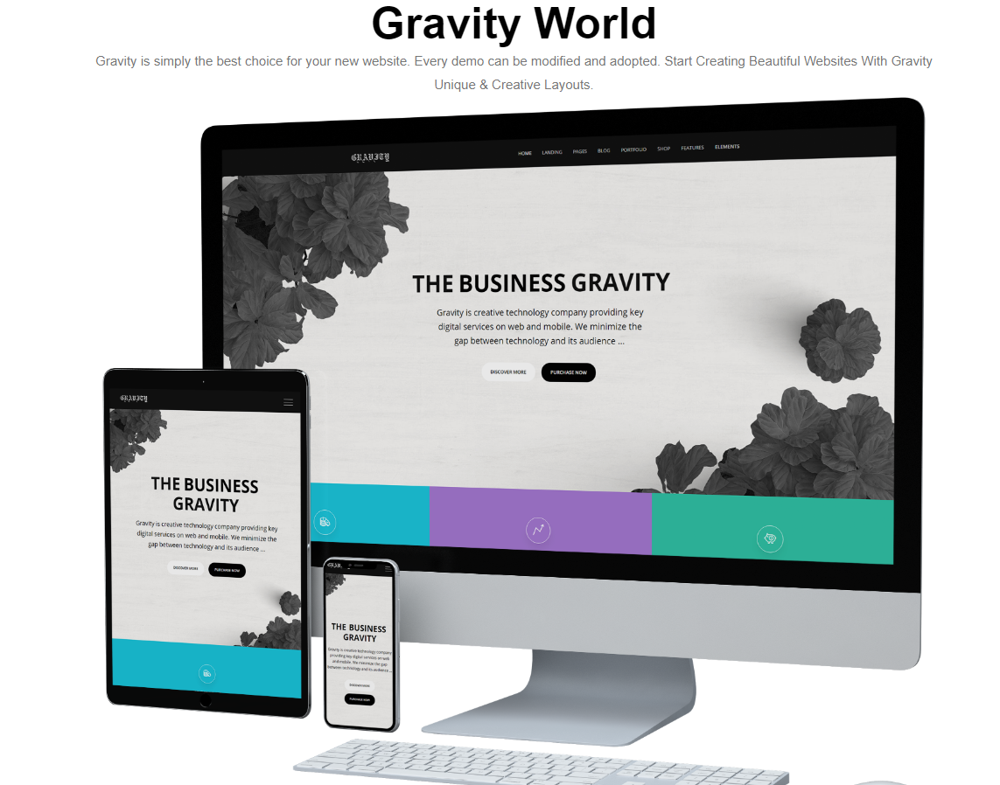

# Gravity - Template

Projeto pessoal desenvolvido apenas para praticar. 

Encontrei esse template e quis replicar afim de 
aprimorar meus conhecimentos em HTML e CSS.

Obviamente só consegui replicar essas duas partes.

### Como inicar o projeto: 

- Basta baixar o código em formato zip.
- Descompactar em uma pasta de sua preferência
- Abrir a pasta no seu vscode ou outro
- Rodar o arquivo com live server.

## Tecnologias e Dependências

| Name | Link |
| ------ | ------ |
| HTML5 | [https://www.w3schools.com/html/] |
| CSS | [https://www.w3schools.com/css/] |
